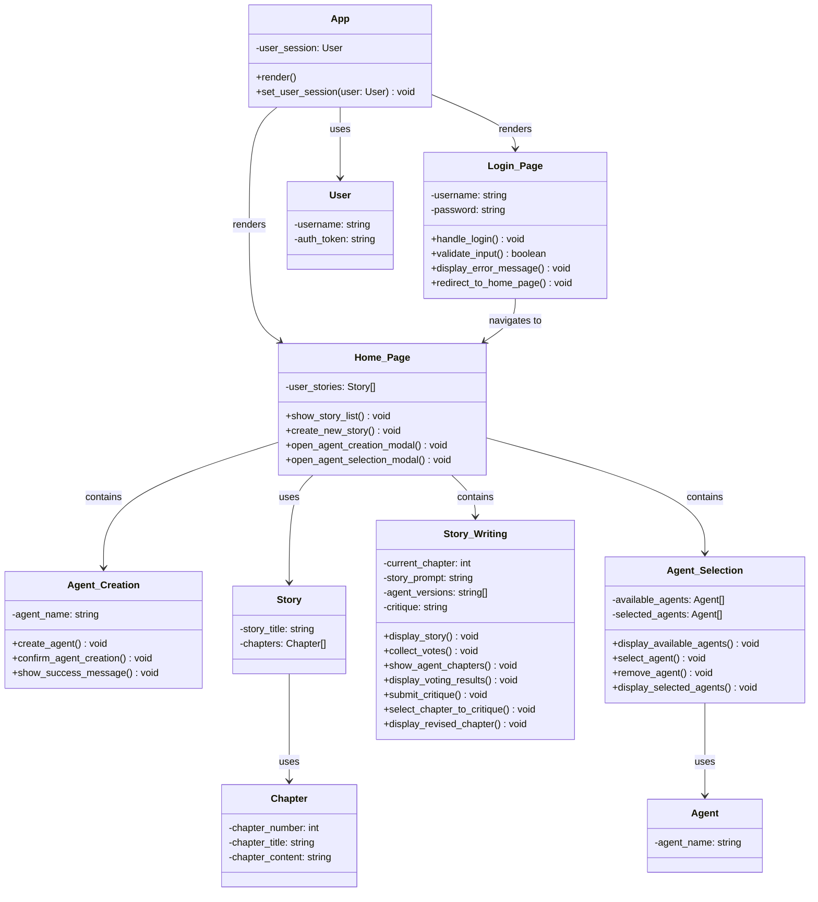

Design Document - Part II API
=============================

**Purpose**

This Design Document gives the complete design of the software implementation. This information should be in structured comments (e.g. Javadoc) in the source files. We encourage the use of a documentation generation tool to generate a draft of your API that you can augment to include the following details.

**Requirements**

In addition to the general documentation requirements the Design Document - Part II API will contain:

General review of the software architecture for each module specified in Design Document - Part I Architecture. Please include your class diagram as an important reference.

**For each class define the data fields, methods.**

The purpose of the class.

The purpose of each data field.

The purpose of each method

Pre-conditions if any.

Post-conditions if any.

Parameters and data types

Return value and output variables

Exceptions thrown\* (PLEASE see note below for details).

An example of an auto-generated and then augmented API specification is here ([Fiscal Design Document 2\_API.docx](https://templeu.instructure.com/courses/106563/files/16928898?wrap=1 "Fiscal Design Document 2_API.docx") )

This group developed their API documentation by hand ([Design Document Part 2 API-1\_MovieMatch.docx](https://templeu.instructure.com/courses/106563/files/16928899?wrap=1 "Design Document Part 2 API-1_MovieMatch.docx") )

\*At the top level, or where appropriate, all exceptions should be caught and an error message that is meaningful to the user generated. It is not OK to say ("xxxx has encountered a problem and will now close (OK?)". Error messages and recovery procedures should be documented in the User’s Manual.

# Frontend API

## Frontend Class Diagram

## App Class
**Purpose:** Manages the user session and controls page rendering based on the session state (login or logged out).

### Data Fields:
- `user_session: User | null`: Stores the current user's session (if logged in) or `null` if no user is logged in.

### Methods:
#### `render(): void`
- **Purpose:** Determines which page to render based on the current user session.
- **Pre-conditions:** The app must be initialized, and the user session must be checked.
- **Post-conditions:** Renders either the `Login_Page` or `Home_Page` based on whether `user_session` is set.
- **Parameters:** None
- **Return value:** None

#### `set_user_session(user: User): void`
- **Purpose:** Sets the current user session and triggers a page re-render.
- **Pre-conditions:** `user` is a valid `User` object.
- **Post-conditions:** `user_session` is set to the passed `user`, and the page is re-rendered to the `Home_Page`.
- **Parameters:** 
  - `user`: `User` object
- **Return value:** None

---

## Login_Page Class
**Purpose:** Manages the login process, including handling user input, validating credentials, and navigating to the home page after a successful login.

### Data Fields:
- `username: string`: Stores the entered username.
- `password: string`: Stores the entered password.

### Methods:
#### `handle_login(): void`
- **Purpose:** Handles the login logic, validates user input, and proceeds to authenticate the user.
- **Pre-conditions:** `username` and `password` are filled by the user.
- **Post-conditions:** Either displays an error message (if invalid) or proceeds to authenticate the user and sets the user session.
- **Parameters:** None
- **Return value:** None

#### `validate_input(): boolean`
- **Purpose:** Validates the entered `username` and `password` before attempting authentication.
- **Pre-conditions:** `username` and `password` are non-empty.
- **Post-conditions:** Returns a boolean indicating whether the input is valid.
- **Parameters:** None
- **Return value:** 
  - `boolean`: `true` if input is valid, `false` otherwise.

#### `display_error_message(): void`
- **Purpose:** Displays an error message when the login fails.
- **Pre-conditions:** `username` or `password` is invalid.
- **Post-conditions:** An error message is shown to the user.
- **Parameters:** None
- **Return value:** None

#### `redirect_to_home_page(): void`
- **Purpose:** Navigates to the home page after a successful login.
- **Pre-conditions:** The user has successfully logged in.
- **Post-conditions:** Redirects the user to the `Home_Page`.
- **Parameters:** None
- **Return value:** None

---

## Home_Page Class
**Purpose:** Displays the user's home page with a list of user stories and options for creating new stories or managing agents.

### Data Fields:
- `user_stories: Story[]`: Stores an array of `Story` objects.

### Methods:
#### `show_story_list(): void`
- **Purpose:** Displays the list of user stories.
- **Pre-conditions:** The `user_stories` array is populated with `Story` objects.
- **Post-conditions:** The story list is rendered on the page.
- **Parameters:** None
- **Return value:** None

#### `create_new_story(): void`
- **Purpose:** Opens the story creation modal to allow the user to create a new story.
- **Pre-conditions:** The user is on the home page.
- **Post-conditions:** Opens the story creation modal.
- **Parameters:** None
- **Return value:** None

#### `open_agent_creation_modal(): void`
- **Purpose:** Opens the agent creation modal.
- **Pre-conditions:** The user is on the home page.
- **Post-conditions:** The agent creation modal is displayed.
- **Parameters:** None
- **Return value:** None

#### `open_agent_selection_modal(): void`
- **Purpose:** Opens the agent selection modal.
- **Pre-conditions:** The user is on the home page.
- **Post-conditions:** The agent selection modal is displayed.
- **Parameters:** None
- **Return value:** None

---

## Agent_Creation Class
**Purpose:** Allows the user to create and confirm new agents.

### Data Fields:
- `agent_name: string`: Stores the name of the agent being created.

### Methods:
#### `create_agent(): void`
- **Purpose:** Creates a new agent with the given `agent_name`.
- **Pre-conditions:** `agent_name` is provided.
- **Post-conditions:** The agent is created and added to the available agents list.
- **Parameters:** None
- **Return value:** None

#### `confirm_agent_creation(): void`
- **Purpose:** Confirms the creation of the new agent and adds it to the system.
- **Pre-conditions:** The agent has been created and validated.
- **Post-conditions:** The new agent is confirmed and displayed in the agent selection modal.
- **Parameters:** None
- **Return value:** None

#### `show_success_message(): void`
- **Purpose:** Displays a success message after the agent is created.
- **Pre-conditions:** The agent has been successfully created.
- **Post-conditions:** A success message is shown to the user.
- **Parameters:** None
- **Return value:** None

---

## Agent_Selection Class
**Purpose:** Manages the selection and removal of agents from the available agents list.

### Data Fields:
- `available_agents: Agent[]`: Stores the list of available agents.
- `selected_agents: Agent[]`: Stores the list of agents selected by the user.

### Methods:
#### `display_available_agents(): void`
- **Purpose:** Displays the list of available agents.
- **Pre-conditions:** The `available_agents` array is populated with `Agent` objects.
- **Post-conditions:** The available agents list is displayed.
- **Parameters:** None
- **Return value:** None

#### `select_agent(): void`
- **Purpose:** Adds an agent to the `selected_agents` list.
- **Pre-conditions:** The agent must be available.
- **Post-conditions:** The agent is added to the `selected_agents` list.
- **Parameters:** None
- **Return value:** None

#### `remove_agent(): void`
- **Purpose:** Removes an agent from the `selected_agents` list.
- **Pre-conditions:** The agent must be in the `selected_agents` list.
- **Post-conditions:** The agent is removed from the list.
- **Parameters:** None
- **Return value:** None

#### `display_selected_agents(): void`
- **Purpose:** Displays the list of selected agents.
- **Pre-conditions:** The `selected_agents` array is populated.
- **Post-conditions:** The selected agents list is displayed.
- **Parameters:** None
- **Return value:** None

---

## Story_Writing Class
**Purpose:** Handles the writing and critique of user stories, including agent involvement and voting.

### Data Fields:
- `current_chapter: int`: Stores the current chapter number being worked on.
- `story_prompt: string`: Stores the prompt for the story.
- `agent_versions: string[]`: Stores different versions of a story chapter.
- `critique: string`: Stores the critique of the current chapter.

### Methods:
#### `display_story(): void`
- **Purpose:** Displays the current story and chapter.
- **Pre-conditions:** The current story and chapter exist.
- **Post-conditions:** The story is displayed to the user.
- **Parameters:** None
- **Return value:** None

#### `collect_votes(): void`
- **Purpose:** Collects votes on the story chapter from agents or users.
- **Pre-conditions:** The chapter is ready for voting.
- **Post-conditions:** Votes are collected and processed.
- **Parameters:** None
- **Return value:** None

#### `show_agent_chapters(): void`
- **Purpose:** Displays the chapters written by different agents.
- **Pre-conditions:** Chapters exist for different agents.
- **Post-conditions:** The agent chapters are displayed.
- **Parameters:** None
- **Return value:** None

#### `display_voting_results(): void`
- **Purpose:** Displays the results of the voting for the current chapter.
- **Pre-conditions:** Votes have been collected.
- **Post-conditions:** The voting results are shown.
- **Parameters:** None
- **Return value:** None

#### `submit_critique(): void`
- **Purpose:** Submits the critique for the current chapter.
- **Pre-conditions:** The critique text is written.
- **Post-conditions:** The critique is submitted.
- **Parameters:** None
- **Return value:** None

#### `select_chapter_to_critique(): void`
- **Purpose:** Allows the user to select which chapter they want to critique.
- **Pre-conditions:** Multiple chapters are available.
- **Post-conditions:** The selected chapter is marked for critique.
- **Parameters:** None
- **Return value:** None

#### `display_revised_chapter(): void`
- **Purpose:** Displays the revised chapter after critique.
- **Pre-conditions:** A revised version of the chapter exists.
- **Post-conditions:** The revised chapter is displayed.
- **Parameters:** None
- **Return value:** None
