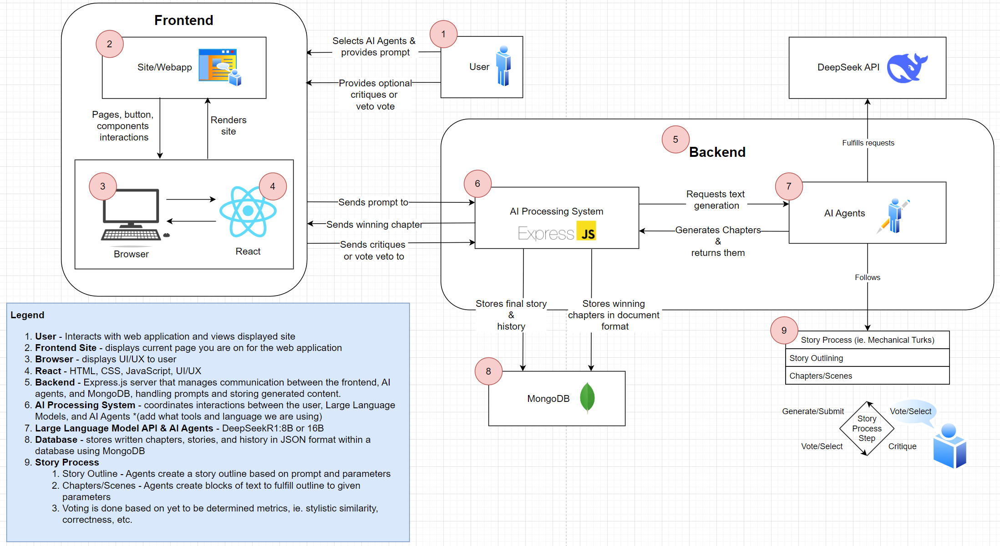

# System Block Diagram

# Description
## Frontend
The user will be able to interact through a broswer interface that is built with React. Here they will be able to select their AI Agents as well as provide a prompt for the AI Agents to generate a story from. They will also be able to review the generated prompts and provide feedback to the AI Agents.

## Backend
The frontend communicates with the backend AI Processing System which manages the data and interactions with the AI Agents and the LLM API. The AI Processing System takes the prompt or critiques provided, and translates that over to the LLM and the AI Agents to generate story content. The content is generated and voted on before being sent back to the frontend and the user for validation or more critiques. When a chapter has been finalized, it is stored in a database along with the rest of the completed story and user data for future retrieval.
