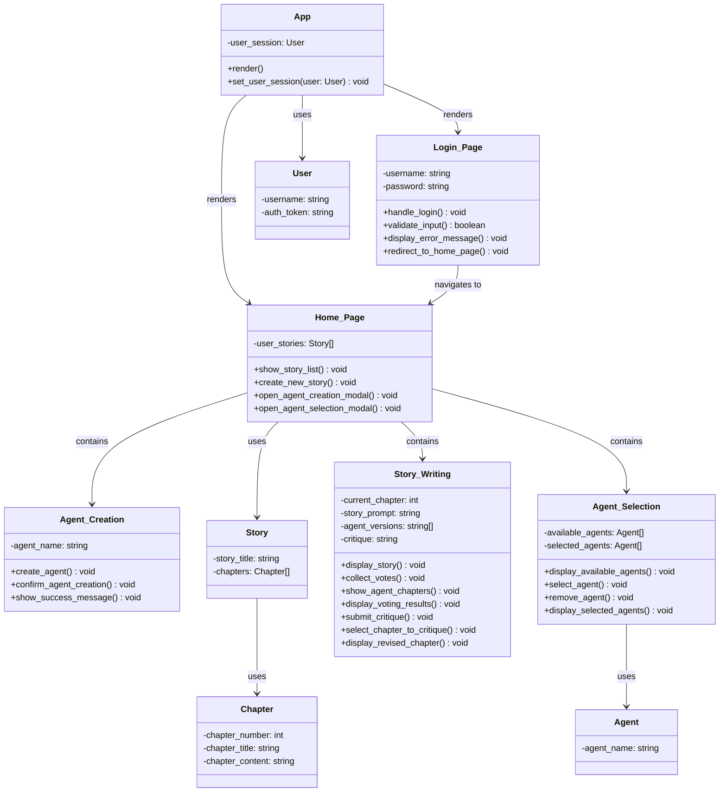

## Frontend Class Diagram

## Sequence Diagrams

### Account Creation

### Account Deletion
Please refer to the Account Creation Diagram before looking at the Account Deletion.

### Agent Creation

### Selecting Writing Mode (Manual: user involvement, Automatic: no user involvement)

### Selecting Involvement Options
Please refer to the Selecting Writing Mode sequence diagram as this is a continuation.

### Initial Writing Process

### Editing Agent Work
Please refer to the Initial Writing Process sequence diagram as this is a continuation.

### Viewing and Editing Chat History

### Voting for Stories
Please refer to the Initial Writing Process sequence diagram as this is a continuation.

### Vetoing Stories
Please refer to the Initial Writing Process sequence diagram as this is a continuation.

### Critiquing Stories
Please refer to the Initial Writing Process sequence diagram as this is a continuation.

### AI Agent Ecosystem
Please refer to the Initial Writing Process sequence diagram as this is a continuation.

