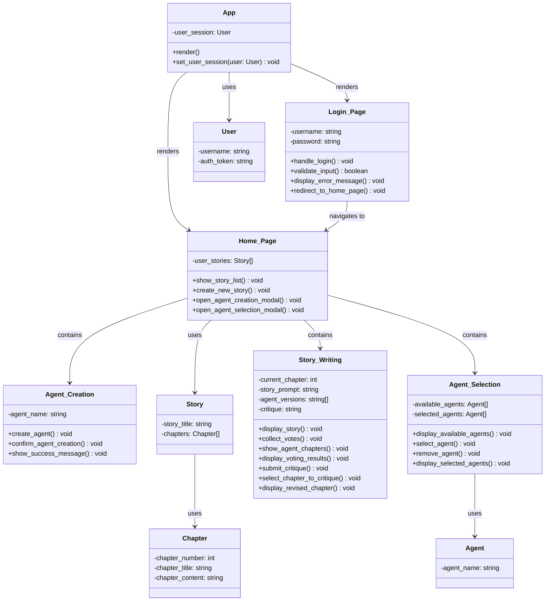

## Frontend Class Diagram

### AI Agent Ecosystem
Please refer to the [Initial Writing Story](./sequence-diagrams.md#initial-writing-story-process-sequence-diagram) Process sequenced diagram as this is a continuation.

