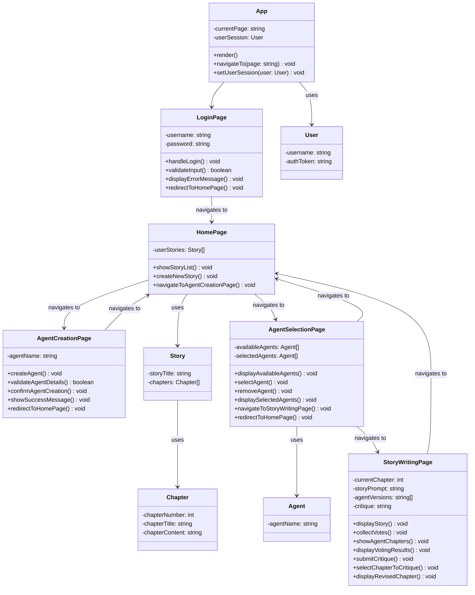

## Frontend Class Diagram


## Agent Drafting Process State Diagram
 ```mermaid
stateDiagram-v2
    [*] --> Story_Drafting: Agents Receives User Story Prompt

   Story_Drafting: Story Drafting
   state Story_Drafting {
      state is_finished <<choice>>
      [*] --> is_finished

      is_finished --> Chapter_Drafting: If There are still Chapters to be Written

      Chapter_Drafting: Chapter Drafting
      state Chapter_Drafting{
         state is_satisfied <<choice>>
         [*] --> is_satisfied
         
         is_satisfied --> Draft: If the User is Not Yet Satisfied with Draft Quality or Drafts Have Not Yet Been Generated
         Draft: Agents Write Drafts

         Draft --> Vote: User May Participate in the Draft Writing Process
         Vote: Agents Vote on which story they believe to be the best

         Vote --> Critique: User May Veto the Vote with Their Own Preference
         Critique: Agents give critiques of Winning Draft

         Critique --> Critique_Vote: User May Add Critiques of Their Own
         Critique_Vote: Agents Vote on which Critiques to Focus

         Critique_Vote --> is_satisfied: User May Select Critiques that the Agents did not Select

         is_satisfied --> [*]: If the Chapter Draft is to the User's Satisfaction
      }

      Chapter_Drafting --> is_finished

      is_finished --> [*]: If All Chapters Requested are Completed
         
   }

   Story_Drafting --> [*]: Story is Saved

```
## Sequence Diagrams

### Account Creation


### Account Deletion
Please refer to the Account Creation Diagram before looking at the Account Deletion.


### Agent Creation


### Selecting Writing Mode (Manual: user involvement, Automatic: no user involvement)


### Selecting Involvement Options
Please refer to the Selecting Writing Mode sequence diagram as this is a continuation.


### Initial Writing Process


### Editing Agent Work
Please refer to the Initial Writing Process sequence diagram as this is a continuation.


### Viewing and Editing Chat History


### Voting for Stories
Please refer to the Initial Writing Process sequence diagram as this is a continuation.


### Vetoing Stories
Please refer to the Initial Writing Process sequence diagram as this is a continuation.


### Critiquing Stories
Please refer to the Initial Writing Process sequence diagram as this is a continuation.


### AI Agent Ecosystem
Please refer to the Initial Writing Process sequence diagram as this is a continuation.


