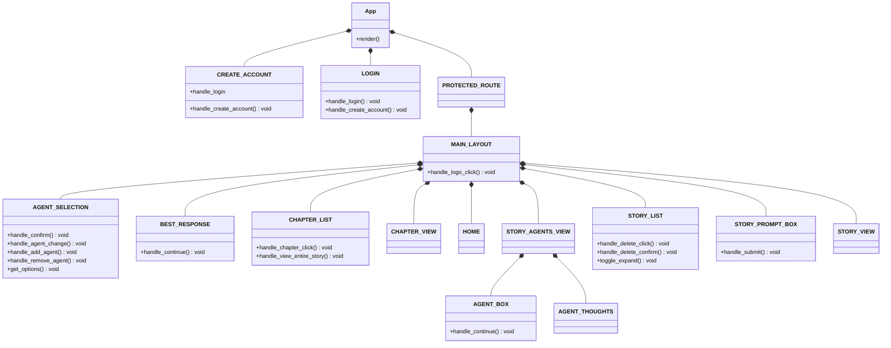
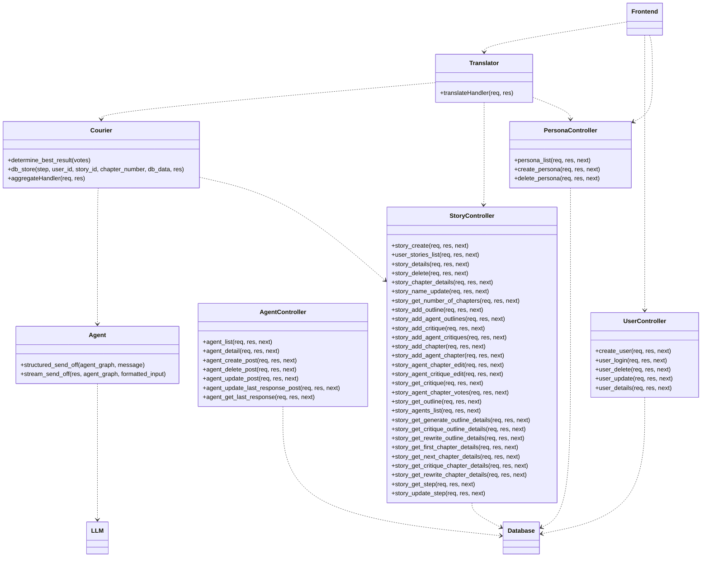

# Class Diagrams

## Frontend Class Diagram

## `App`
### Purpose
Describes the root component of the application.

### Data Fields
_None_

### Methods
#### `render()`
- **Purpose**: Render the main application layout.
- **Pre-conditions**: Application initialized.
- **Post-conditions**: Application UI is returned/displayed.
- **Parameters**: None  
- **Return Value**: `JSX.Element`  
- **Exceptions Thrown**: None

---

## `AGENT_BOX`
### Purpose
Manages the display for individual agent responses.

### Data Fields
_None_

### Methods
#### `handle_continue(): void`
- **Purpose**: Proceed to the next chapter generation with this specificied agent response.
- **Pre-conditions**: Agents must be done streaming previous response.
- **Post-conditions**: Streaming for next chapter apparent.
- **Parameters**: None  
- **Return Value**: `void`  
- **Exceptions Thrown**: None

---

## `AGENT_SELECTION`
### Purpose
Manages agent-related actions: selecting, adding, removing agents.

### Data Fields
_None_

### Methods
#### `handle_confirm(): void`
- **Purpose**: Confirm selected agents.
- **Parameters**: None  
- **Return Value**: `void`  
- **Exceptions Thrown**: None

#### `handle_agent_change(): void`
- **Purpose**: Change selected agent.
- **Parameters**: None  
- **Return Value**: `void`  
- **Exceptions Thrown**: None

#### `handle_add_agent(): void`
- **Purpose**: Add a new agent.
- **Parameters**: None  
- **Return Value**: `void`  
- **Exceptions Thrown**: None

#### `handle_remove_agent(): void`
- **Purpose**: Remove an existing agent slot.
- **Parameters**: None  
- **Return Value**: `void`  
- **Exceptions Thrown**: None

#### `get_options(): void`
- **Purpose**: Fetch available agent options.
- **Parameters**: None  
- **Return Value**: `void`  
- **Exceptions Thrown**: None

---

## `AGENT_THOUGHTS`
### Purpose
Displays or handles agent-generated thoughts about their response.

### Data Fields / Methods
_None currently defined_

---

## `BEST_RESPONSE`
### Purpose
Displays highest voted response and nothing else.

### Methods
#### `handle_continue(): void`
- **Purpose**: Generate next chapter with this response.
- **Parameters**: None  
- **Return Value**: `void`  
- **Exceptions Thrown**: None

---

## `CHAPTER_LIST`
### Purpose
Displays list of chapters and allows navigation.

### Methods
#### `handle_chapter_click(): void`
- **Purpose**: Navigate to clicked chapter.
- **Parameters**: None  
- **Return Value**: `void`  
- **Exceptions Thrown**: None

#### `handle_view_entire_story(): void`
- **Purpose**: Navigate to entire story view.
- **Parameters**: None  
- **Return Value**: `void`  
- **Exceptions Thrown**: None

---

## `CHAPTER_VIEW`
### Purpose
Displays selected chapter.

---

## `CREATE_ACCOUNT`
### Purpose
Handles user registration.

### Methods
#### `handle_create_account(): void`
- **Purpose**: Submit and create a new account.
- **Parameters**: None  
- **Return Value**: `void`  
- **Exceptions Thrown**: None

#### `handle_login`
- **Purpose**: Redirect to login.
- **Exceptions Thrown**: None

---

## `LOGIN`
### Purpose
Handles login logic.

### Methods
#### `handle_login(): void`
- **Purpose**: Log in a user.
- **Parameters**: None  
- **Return Value**: `void`  
- **Exceptions Thrown**: On invalid credentials.

#### `handle_create_account(): void`
- **Purpose**: Redirect to account creation.
- **Parameters**: None  
- **Return Value**: `void`  
- **Exceptions Thrown**: None

---

## `HOME`
### Purpose
Base screen for no story selected.

---

## `MAIN_LAYOUT`
### Purpose
Contains shared structure like navbar, sidebars, and routing.

### Methods
#### `handle_logo_click(): void`
- **Purpose**: Navigate home when logo is clicked.
- **Parameters**: None  
- **Return Value**: `void`  
- **Exceptions Thrown**: None

---

## `PROTECTED_ROUTE`
### Purpose
Wraps routes that require authentication.

---

## `STORY_AGENTS_VIEW`
### Purpose
Displays selected agents and their responses and thoughts.

---

## `STORY_LIST`
### Purpose
Displays stories with delete and expand functionality.

### Methods
#### `handle_delete_click(): void`
- **Purpose**: Opt to delete story chosen.
- **Parameters**: None  
- **Return Value**: `void`  
- **Exceptions Thrown**: None

#### `handle_delete_confirm(): void`
- **Purpose**: Confirm deletion of story.
- **Parameters**: None  
- **Return Value**: `void`  
- **Exceptions Thrown**: On backend failure or access issues.

#### `toggle_expand(): void`
- **Purpose**: Expand dropdown of story.
- **Parameters**: None  
- **Return Value**: `void`  
- **Exceptions Thrown**: None

---

## `STORY_PROMPT_BOX`
### Purpose
Handles user input for story prompts.

### Methods
#### `handle_submit(): void`
- **Purpose**: Submit the entered prompt.
- **Parameters**: None  
- **Return Value**: `void`  
- **Exceptions Thrown**: On empty or invalid prompt

---

## `STORY_VIEW`
### Purpose
Displays a story for viewing.

---
## Backend Class Diagram

## `Agent`
### Purpose
Encapsulates logic for dispatching messages to and receiving responses from the LLM according to an agent graph.

### Data Fields
_None_

### Methods
#### `structured_send_off(agent_graph, message): Promise<any>`
- **Purpose**: Send a discrete, structured request to the LLM based on the given agent graph and input message.  
- **Pre-conditions**: `agent_graph` is a valid graph object; `message` is non-empty.  
- **Post-conditions**: Resolves with the LLM’s parsed response.  
- **Parameters**:  
  - `agent_graph` (Object): Defines nodes and transitions for this agent.  
  - `message` (string): User’s or system’s input text.  
- **Return Value**: `Promise<any>` — the structured LLM response.  
- **Exceptions Thrown**: May reject on invalid graph or LLM errors.

#### `stream_send_off(res, agent_graph, formatted_input): void`
- **Purpose**: Stream the LLM’s output directly to an HTTP response in chunks, following the specified agent graph.  
- **Pre-conditions**: `res` is an active Express response; streaming is supported by the LLM.  
- **Post-conditions**: Chunks of generated text are piped to `res` until completion.  
- **Parameters**:  
  - `res` (Response): Express response object for streaming.  
  - `agent_graph` (Object): Defines the streaming logic.  
  - `formatted_input` (string): Pre-processed prompt text.  
- **Return Value**: `void`  
- **Exceptions Thrown**: May throw on network/stream errors.

---

## `Courier`
### Purpose
Aggregates agent votes, determines consensus, persists intermediary data to the database, and handles batch requests.

### Data Fields
_None_

### Methods
#### `determine_best_result(votes): any`
- **Purpose**: Compute the winning response based on an array of agent votes.  
- **Pre-conditions**: `votes` is a non-empty array of comparable vote objects.  
- **Post-conditions**: Returns the vote with highest score or tie-break logic applied.  
- **Parameters**:  
  - `votes` (Array): List of vote objects from agents.  
- **Return Value**: `any` — the selected result object.  
- **Exceptions Thrown**: None

#### `db_store(step, user_id, story_id, chapter_number, db_data, res): Promise<void>`
- **Purpose**: Persist a step’s data and the LLM response to the database.  
- **Pre-conditions**: All identifiers are valid; database connection is live.  
- **Post-conditions**: Data is stored and an acknowledgment may be sent on `res`.  
- **Parameters**:  
  - `step` (string): The stage name (e.g., “outline”, “chapter”).  
  - `user_id` (string): ID of the requesting user.  
  - `story_id` (string): ID of the current story.  
  - `chapter_number` (number): Chapter index.  
  - `db_data` (Object): Payload to store.  
  - `res` (Response): Express response to confirm storage.  
- **Return Value**: `Promise<void>`  
- **Exceptions Thrown**: May reject on DB errors.

#### `aggregateHandler(req, res): void`
- **Purpose**: Express route handler that collects votes from multiple agents, invokes aggregation, and returns the final result.  
- **Pre-conditions**: Request body contains `votes` array and identifiers.  
- **Post-conditions**: Sends JSON with the aggregated best result.  
- **Parameters**:  
  - `req` (Request): Express request object.  
  - `res` (Response): Express response object.  
- **Return Value**: `void`  
- **Exceptions Thrown**: Forwards errors via Express error middleware.

---

## `Translator`
### Purpose
Acts as a façade, translating frontend HTTP calls into Courier or StoryController actions with proper payload formatting.

### Data Fields
_None_

### Methods
#### `translateHandler(req, res): void`
- **Purpose**: Route incoming HTTP requests to the appropriate backend service (Courier or StoryController) after input validation.  
- **Pre-conditions**: Request URL and method correspond to a known translation.  
- **Post-conditions**: Invokes the target handler and streams or returns its response.  
- **Parameters**:  
  - `req` (Request): Express request object.  
  - `res` (Response): Express response object.  
- **Return Value**: `void`  
- **Exceptions Thrown**: Forwards errors via Express error middleware.

---

## `AgentController`
### Purpose
CRUD operations for agent configurations stored in the database.

### Data Fields
_None_

### Methods
#### `agent_list(req, res, next): void`
- **Purpose**: Retrieve a list of all agents.  
- **Pre-conditions**: User is authenticated.  
- **Post-conditions**: Sends JSON array of agents.

#### `agent_detail(req, res, next): void`
- **Purpose**: Fetch details for a single agent by ID.  
- **Pre-conditions**: `req.params.id` is provided.  
- **Post-conditions**: Sends JSON with agent data.

#### `agent_create_post(req, res, next): void`
- **Purpose**: Create a new agent record.  
- **Pre-conditions**: Request body contains valid agent fields.  
- **Post-conditions**: Inserts into DB and returns created agent.

#### `agent_delete_post(req, res, next): void`
- **Purpose**: Delete an agent by ID.  
- **Pre-conditions**: `req.params.id` matches existing record.  
- **Post-conditions**: Removes from DB and confirms deletion.

#### `agent_update_post(req, res, next): void`
- **Purpose**: Update an agent’s properties.  
- **Pre-conditions**: Valid ID and update payload.  
- **Post-conditions**: Persists changes and returns updated agent.

#### `agent_update_last_response_post(req, res, next): void`
- **Purpose**: Store the last response text for an agent.  
- **Pre-conditions**: Agent exists; `req.body.response` is non-empty.  
- **Post-conditions**: Updates record and returns acknowledgment.

#### `agent_get_last_response(req, res, next): void`
- **Purpose**: Retrieve the stored last response for an agent.  
- **Pre-conditions**: Agent ID provided.  
- **Post-conditions**: Sends the last response text.

---

## `PersonaController`
### Purpose
Manage user-defined personas used to seed agent behavior.

### Data Fields
_None_

### Methods
#### `persona_list(req, res, next): void`
- **Purpose**: List all personas for the authenticated user.  
- **Pre-conditions**: User session is valid.  
- **Post-conditions**: Sends JSON array of personas.

#### `create_persona(req, res, next): void`
- **Purpose**: Create a new persona entry.  
- **Pre-conditions**: Request body includes persona name and attributes.  
- **Post-conditions**: Persists persona and returns its record.

#### `delete_persona(req, res, next): void`
- **Purpose**: Delete an existing persona by ID.  
- **Pre-conditions**: Persona ID is valid.  
- **Post-conditions**: Removes persona and confirms deletion.

---

## `StoryController`
### Purpose
Handles all story lifecycle actions: creation, retrieval, updating outlines/chapters/critiques, and stepping through the story generation process.

### Data Fields
_None_

### Methods
#### `story_create(req, res, next): void`
- **Purpose**: Initialize a new story for a user.  
- **Pre-conditions**: User authenticated; title provided.  
- **Post-conditions**: Creates DB record and returns story metadata.

#### `user_stories_list(req, res, next): void`
- **Purpose**: Fetch all stories belonging to the current user.  
- **Pre-conditions**: Valid user session.  
- **Post-conditions**: Returns array of story summaries.

#### `story_details(req, res, next): void`
- **Purpose**: Get full details for a specific story.  
- **Pre-conditions**: `req.params.story_id` is valid.  
- **Post-conditions**: Returns JSON story object.

#### `story_delete(req, res, next): void`
- **Purpose**: Remove a story and its associated chapters/outlines.  
- **Pre-conditions**: Story exists and belongs to user.  
- **Post-conditions**: Deletes DB records and confirms.

#### `story_chapter_details(req, res, next): void`
- **Purpose**: Retrieve a particular chapter’s text and metadata.  
- **Pre-conditions**: Chapter number valid.  
- **Post-conditions**: Sends chapter JSON.

#### `story_name_update(req, res, next): void`
- **Purpose**: Rename an existing story.  
- **Pre-conditions**: New name provided.  
- **Post-conditions**: Updates DB and returns updated story.

#### `story_get_number_of_chapters(req, res, next): void`
- **Purpose**: Return count of chapters in a story.  
- **Pre-conditions**: Story ID valid.  
- **Post-conditions**: Sends integer count.

#### `story_add_outline(req, res, next): void`
- **Purpose**: Generate and store a story outline via agents.  
- **Pre-conditions**: Story exists; outline parameters provided.  
- **Post-conditions**: Persists outline in DB and returns it.

#### `story_add_agent_outlines(req, res, next): void`
- **Purpose**: Generate multiple agent-specific outlines for comparison.  
- **Pre-conditions**: Same as `story_add_outline`.  
- **Post-conditions**: Stores each agent’s outline.

#### `story_add_critique(req, res, next): void`
- **Purpose**: Solicit critique on an existing outline/chapter.  
- **Pre-conditions**: Target content exists.  
- **Post-conditions**: Persists critique and returns feedback.

#### `story_add_agent_critiques(req, res, next): void`
- **Purpose**: Gather agent-specific critiques for comparison.  
- **Pre-conditions**: Same as `story_add_critique`.  
- **Post-conditions**: Stores each critique.

#### `story_add_chapter(req, res, next): void`
- **Purpose**: Generate the next chapter from approved outline.  
- **Pre-conditions**: Outline finalized.  
- **Post-conditions**: Saves chapter text.

#### `story_add_agent_chapter(req, res, next): void`
- **Purpose**: Produce multiple candidate chapters via different agents.  
- **Pre-conditions**: Same as `story_add_chapter`.  
- **Post-conditions**: Persists each candidate.

#### `story_agent_chapter_edit(req, res, next): void`
- **Purpose**: Apply user’s edits to a generated chapter.  
- **Pre-conditions**: Chapter exists.  
- **Post-conditions**: Updates DB and returns revised text.

#### `story_agent_critique_edit(req, res, next): void`
- **Purpose**: Refine a stored critique based on user feedback.  
- **Pre-conditions**: Critique exists.  
- **Post-conditions**: Persists updated critique.

#### `story_get_critique(req, res, next): void`
- **Purpose**: Retrieve stored critique for a chapter or outline.  
- **Pre-conditions**: IDs valid.  
- **Post-conditions**: Sends critique JSON.

#### `story_agent_chapter_votes(req, res, next): void`
- **Purpose**: Collect user or agent votes on candidate chapters.  
- **Pre-conditions**: Candidate chapters present.  
- **Post-conditions**: Stores votes and returns tally.

#### `story_get_outline(req, res, next): void`
- **Purpose**: Fetch the main outline for review.  
- **Pre-conditions**: Outline exists.  
- **Post-conditions**: Sends outline JSON.

#### `story_agents_list(req, res, next): void`
- **Purpose**: List agents assigned to a story.  
- **Pre-conditions**: Story ID provided.  
- **Post-conditions**: Returns agent IDs and metadata.

#### `story_get_generate_outline_details(req, res, next): void`
- **Purpose**: Provide status/details of an in-progress outline generation.  
- **Pre-conditions**: Generation initiated.  
- **Post-conditions**: Sends progress info.

#### `story_get_critique_outline_details(req, res, next): void`
- **Purpose**: Provide status/details of critique generation on the outline.  
- **Pre-conditions**: Critique step started.  
- **Post-conditions**: Returns progress info.

#### `story_get_rewrite_outline_details(req, res, next): void`
- **Purpose**: Provide status/details of an outline rewrite step.  
- **Pre-conditions**: Rewrite step initiated.  
- **Post-conditions**: Sends progress info.

#### `story_get_first_chapter_details(req, res, next): void`
- **Purpose**: Return details on the initial chapter generation.  
- **Pre-conditions**: First chapter generation done.  
- **Post-conditions**: Sends chapter meta.

#### `story_get_next_chapter_details(req, res, next): void`
- **Purpose**: Return details on the latest chapter generation.  
- **Pre-conditions**: Next chapter exists.  
- **Post-conditions**: Sends chapter meta.

#### `story_get_critique_chapter_details(req, res, next): void`
- **Purpose**: Provide status/details of chapter critique.  
- **Pre-conditions**: Critique in progress or done.  
- **Post-conditions**: Returns critique status.

#### `story_get_rewrite_chapter_details(req, res, next): void`
- **Purpose**: Provide status/details of chapter rewrite.  
- **Pre-conditions**: Rewrite step started.  
- **Post-conditions**: Sends progress info.

#### `story_get_step(req, res, next): void`
- **Purpose**: Retrieve the current step name in the story pipeline.  
- **Pre-conditions**: Story exists.  
- **Post-conditions**: Returns step identifier.

#### `story_update_step(req, res, next): void`
- **Purpose**: Advance or modify the current story pipeline step.  
- **Pre-conditions**: Valid new step provided.  
- **Post-conditions**: Updates step in DB.

---

## `UserController`
### Purpose
Handle user account creation, authentication, updates, and deletion.

### Data Fields
_None_

### Methods
#### `create_user(req, res, next): void`
- **Purpose**: Register a new user.  
- **Pre-conditions**: `req.body` contains username/password.  
- **Post-conditions**: Persists user record and returns profile.

#### `user_login(req, res, next): void`
- **Purpose**: Authenticate user credentials and issue session or token.  
- **Pre-conditions**: Valid credentials in request.  
- **Post-conditions**: Sets session/cookie and returns success.

#### `user_delete(req, res, next): void`
- **Purpose**: Remove a user account.  
- **Pre-conditions**: Authenticated as target user or admin.  
- **Post-conditions**: Deletes user record and related data.

#### `user_update(req, res, next): void`
- **Purpose**: Modify user profile fields.  
- **Pre-conditions**: Valid update payload.  
- **Post-conditions**: Persists changes and returns updated profile.

#### `user_details(req, res, next): void`
- **Purpose**: Fetch profile details for the current or specified user.  
- **Pre-conditions**: Authentication or target user ID.  
- **Post-conditions**: Sends user JSON.
