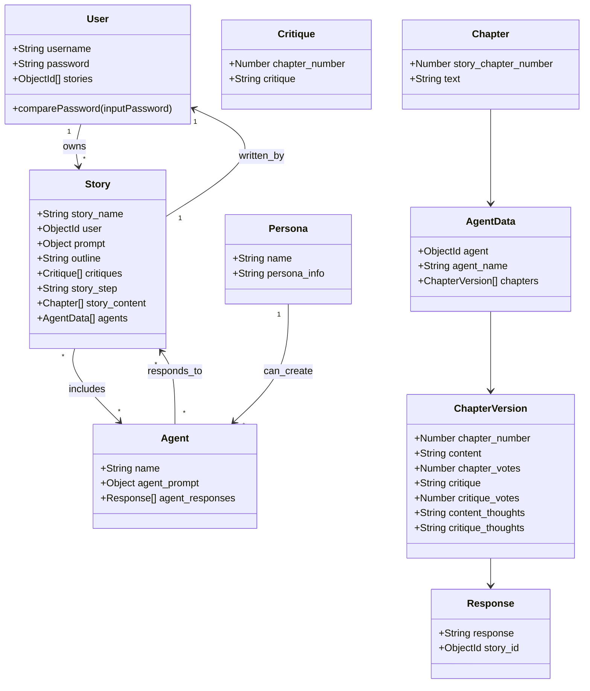

# UML Association Diagram
### MongoDB Database Schema Design

```mermaid
classDiagram
    direction TB

    class User {
        +String username
        +String password
        +ObjectId[] stories
        +comparePassword(inputPassword)
    }

    class Story {
        +String story_name
        +ObjectId user
        +Object prompt
        +String outline
        +Critique[] critiques
        +String story_step
        +Chapter[] story_content
        +AgentData[] agents
    }

    class Persona {
        +String name
        +String persona_info
    }

    class Agent {
        +String name
        +Object agent_prompt
        +Response[] agent_responses
    }

    class Critique {
        +Number chapter_number
        +String critique
    }

    class Chapter {
        +Number story_chapter_number
        +String text
    }

    class AgentData {
        +ObjectId agent
        +String agent_name
        +ChapterVersion[] chapters
    }

    class ChapterVersion {
        +Number chapter_number
        +String content
        +Number chapter_votes
        +String critique
        +Number critique_votes
        +String content_thoughts
        +String critique_thoughts
    }

    class Response {
        +String response
        +ObjectId story_id
    }

    %% Associations
    User "1" --> "*" Story : owns
    Story "1" --> "1" User : written_by
    Story "*" --> "*" Agent : includes
    Agent "*" --> "*" Story : responds_to
    Persona "1" --> "*" Agent : can_create

    %% Arrange Chapter, AgentData, ChapterVersion, Response vertically
    Chapter --> AgentData
    AgentData --> ChapterVersion
    ChapterVersion --> Response
```
