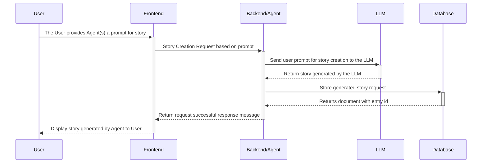
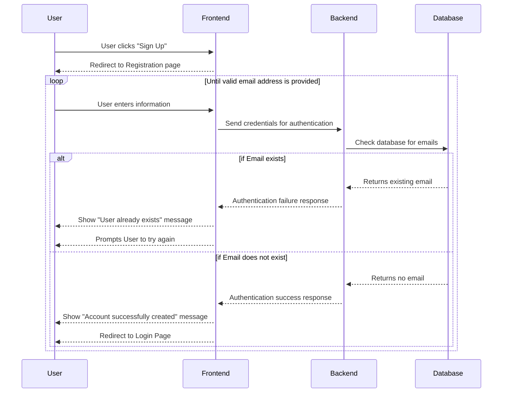

# Sequence Diagrams

## Initial Writing Story Process Sequence Diagram 
Many sequence diagrams use this initial sequence. Each Diagram that continues after this sequence will clarify that it continues from this sequence.

## Use Case 1: Account Creation

## Use Case 2: Agent Creation

## Use Case 3: Agent Deletion

## Use Case 4: Manual vs Automatic Mode Sequence Diagram

## Use Case 5: Involvement Options

## Use Case 6: Editing Agent Work
This diagram assumes the sequence of events in [Initial Writing Story](#initial-writing-story-process-sequence-diagram) Process Sequence Diagram. 

## Use Case 7: Viewing and Editing Chat History
This diagram assumes the sequence of events in [Initial Writing Story](#initial-writing-story-process-sequence-diagram) Process Sequence Diagram. 

## Use Case 8: Voting for Stories
This diagram assumes the sequence of events in [Initial Writing Story](#initial-writing-story-process-sequence-diagram) Process Sequence Diagram.

## User Case 9: Vetoing Stories
This diagram assumes the sequence of events in [Initial Writing Story](#initial-writing-story-process-sequence-diagram) Process Sequence Diagram.

## Use Case 10: Critiquing Stories
This diagram assumes the sequence of events in [Initial Writing Story](#initial-writing-story-process-sequence-diagram) Process Sequence Diagram.

