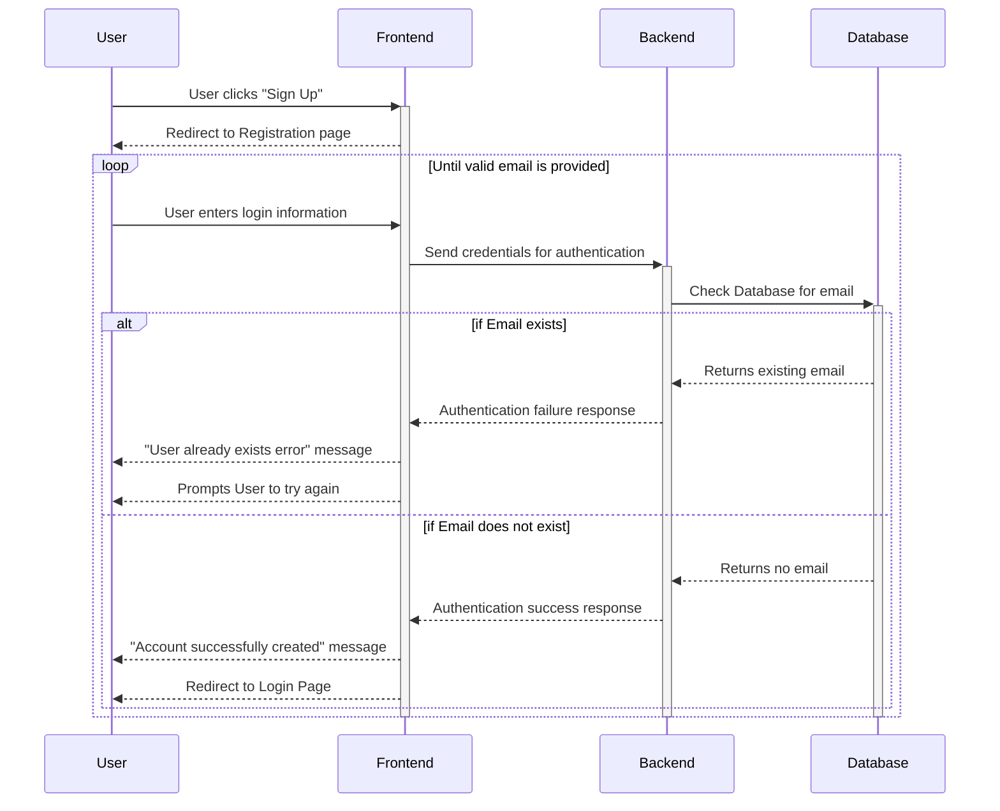
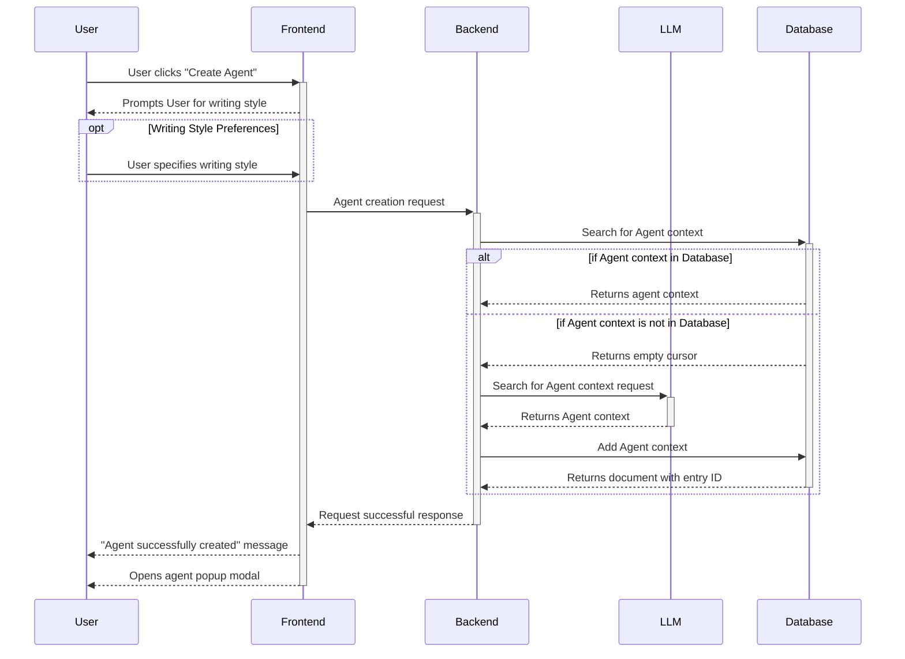
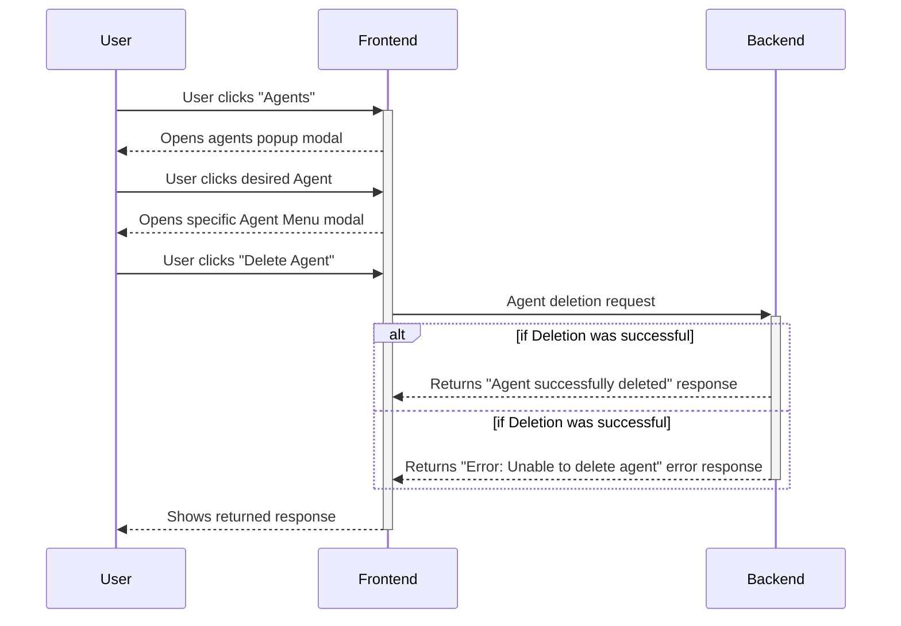
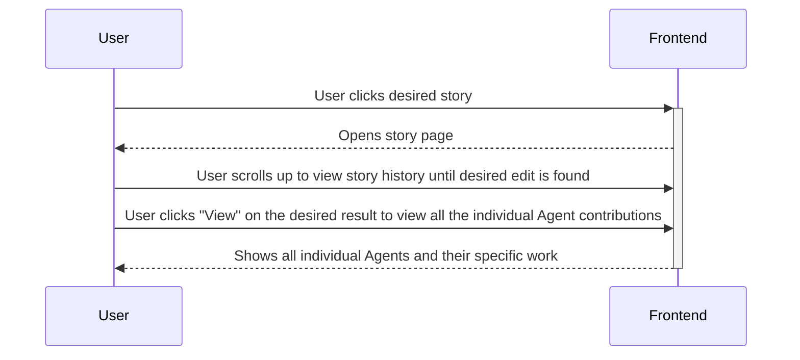
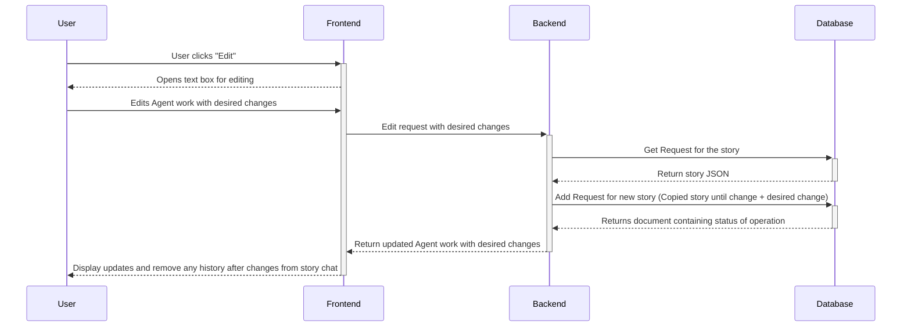
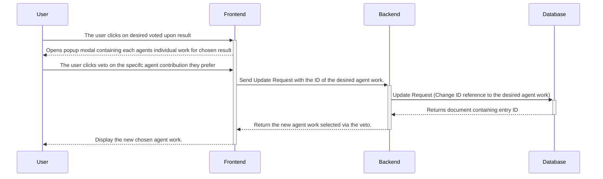
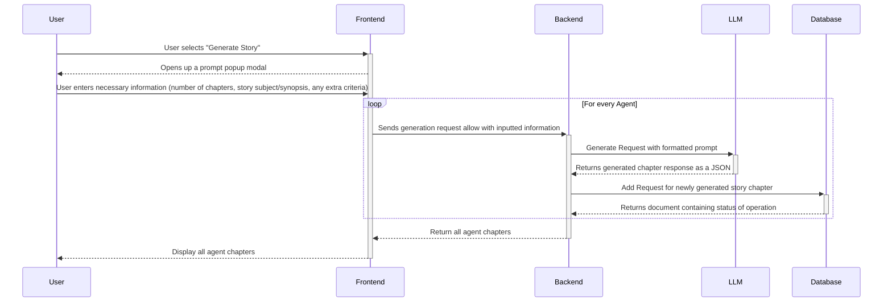
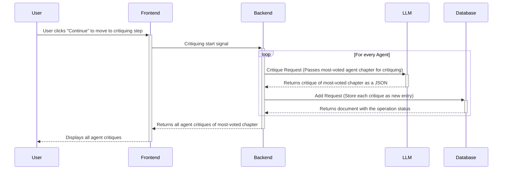
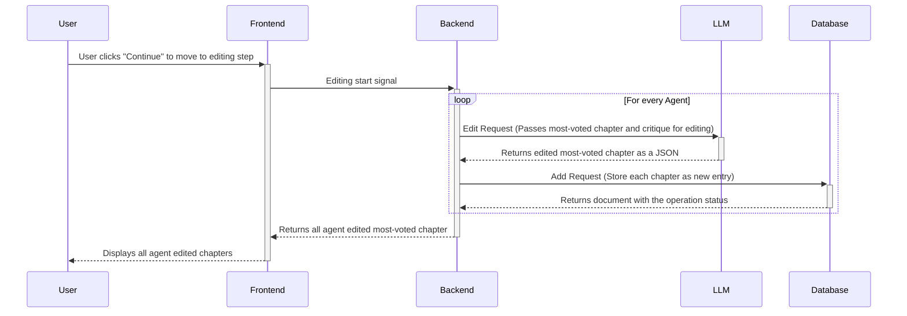

# Sequence Diagrams

## Use Case 1: Account Creation

## Use Case 2: Agent Creation

## Use Case 3: Agent Deletion

## Use Case 4: Viewing History

## Use Case 5: Editing Agent Work
This diagram assumes the sequence of events in [Agent Story Generation](#use-case-7-agent-story-generation) sequence diagram.

This diagram follows the [Viewing History](#use-case-4-viewing-history-sequence-diagram) sequence diagram for finding the desired agent work to edit.

## User Case 6: Vetoing Agent Votes
This diagram assumes the sequence of events in [Agent Story Generation](#use-case-7-agent-story-generation) sequence diagram.

## Use Case 7: Agent Story Generation

## Use Case 9: Agent Critiquing
This diagram assumes the sequence of events in the following sequence diagrams in the following order:
1. [Agent Story Generation](#use-case-7-agent-story-generation)
2. [Agent Voting](#use-case-8-agent-voting) on the generated chapters

## Use Case 10: Agent Editing
This diagram assumes the sequence of events in the following sequence diagrams in the following order:
1. [Agent Story Generation](#use-case-7-agent-story-generation)
2. [Agent Voting](#use-case-8-agent-voting) on the generated chapters
3. [Agent Critiquing](#use-case-9-agent-critiquing)
4. [Agent Voting](#use-case-8-agent-voting) on the generated critiques
