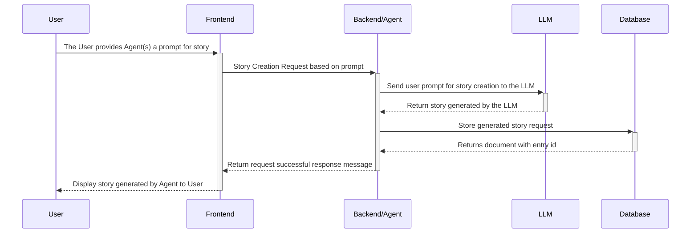
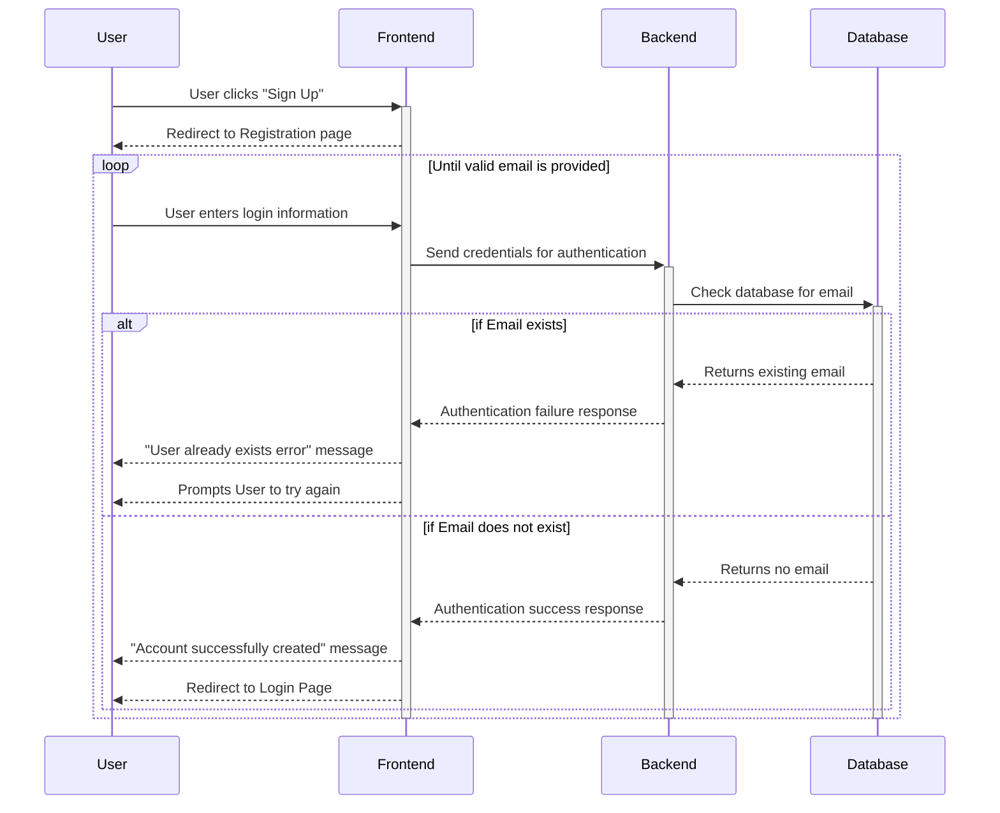
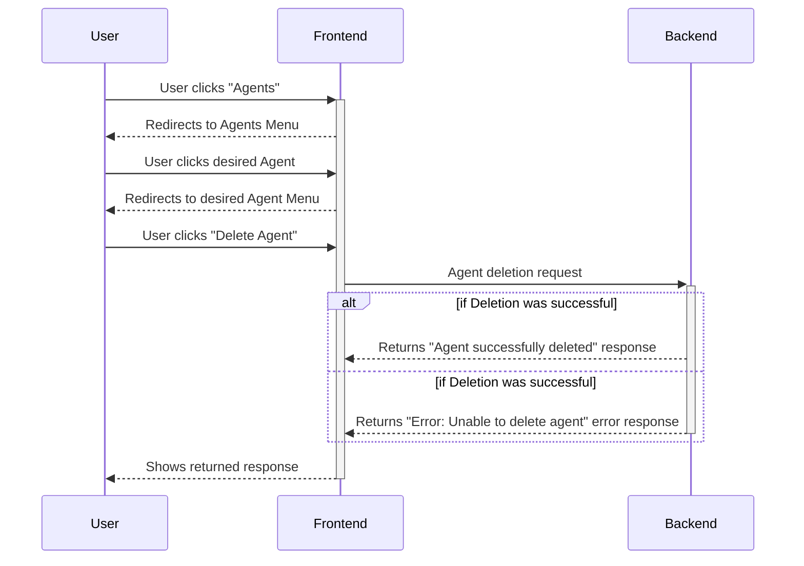
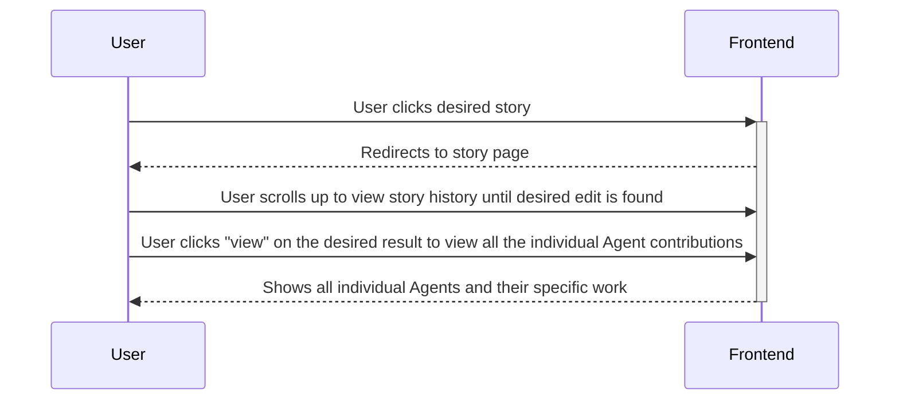

# Sequence Diagrams

## Initial Writing Story Process Sequence Diagram 
Many sequence diagrams use this initial sequence. Each Diagram that continues after this sequence will clarify that it continues from this sequence.

## Use Case 1: Account Creation Sequence Diagran

## Use Case 2: Agent Creation Sequence Diagram

## Use Case 3: Agent Deletion Sequence Diagram

## Use Case 4: Viewing History Sequence Diagram

## Use Case 5: Editing Agent Work
This diagram follows the [Viewing History](#use-case-4-viewing-history-sequence-diagram) sequence diagram. If the desired edit is the most current the diagram still applies as the only change is the lack of scrolling up to find it.

## Use Case 6: Voting for Stories
This diagram assumes the sequence of events in [Initial Writing Story](#initial-writing-story-process-sequence-diagram) Process Sequence Diagram.

## User Case 7: Vetoing Stories
This diagram assumes the sequence of events in [Initial Writing Story](#initial-writing-story-process-sequence-diagram) Process Sequence Diagram.

## Use Case 8: Critiquing Stories
This diagram assumes the sequence of events in [Initial Writing Story](#initial-writing-story-process-sequence-diagram) Process Sequence Diagram.

